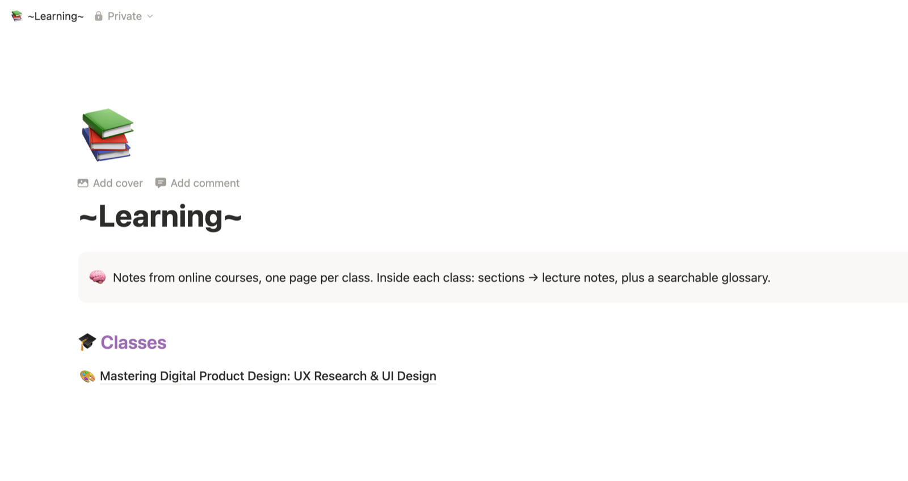

# Course Notes

A Claude skill that turns messy online-course transcripts into clean, structured study notes, so you can review a lecture instead of rewatching it.

Paste a transcript from Udemy, Coursera, Skillshare, LinkedIn Learning or YouTube, and Claude:

- **Fixes caption problems.** It rejoins lines split mid-sentence and corrects misheard terms ("Fig ma" → Figma, "shift a" → `Shift + A`). Anything it isn't sure about is marked `[?]`.
- **Removes filler**, like "welcome back", "please leave a review" and recaps of earlier videos.
- **Writes notes in the same layout every time:** Vocabulary → Main Concepts → How-to Steps → Shortcuts & Code → Tips & Gotchas → Resources → Key Takeaways → Review Questions (answers hidden until you click).
- **Files them by class.** In Notion: class → section → lecture pages, plus a searchable glossary for each class. Locally: Markdown files in one folder per class.
- **Sticks to what was taught.** It adds no outside facts. Terms the lecture used without defining are marked *(not defined in this lecture)*.

See it in action: [sample transcript](examples/sample-transcript.txt) → [generated notes](examples/sample-notes.md).

### What it looks like in Notion

**Home page.** Every class you're taking, in one place:



**Class page.** Sections link to lecture notes, and every vocabulary term is collected in a glossary you can filter by lecture or section:


## Setup

### 1. Install the skill

**Option A: as a Claude Code plugin (recommended)**

In Claude Code, run:
```
/plugin marketplace add ItsAlwaysRaining/claude-skills
/plugin install course-notes@claude-skills
```

**Option B: copy it manually**

```bash
git clone https://github.com/ItsAlwaysRaining/claude-skills.git
mkdir -p ~/.claude/skills
cp -r claude-skills/plugins/course-notes/skills/course-notes ~/.claude/skills/
```

**Claude.ai (web/desktop app):** zip the `skills/course-notes` folder and upload it in Settings → Capabilities → Skills.

### 2. Connect Notion (optional, skip for local-only)

The skill uses Notion's official connector. Pick one:

- **Claude.ai connector:** claude.ai → Settings → Connectors → Notion → Connect.
- **Claude Code:**
  ```bash
  claude mcp add --transport http notion https://mcp.notion.com/mcp
  ```
  Then start `claude`, run `/mcp`, choose **notion** → **Authenticate**, and approve access in your browser.

Restart Claude afterwards, since connections load when a session starts. Notion handles the sign-in; the skill never stores passwords or tokens.

### 3. First run

Paste a transcript. On first use Claude asks two quick questions and saves your answers to `~/.claude/course-notes/config.md`:

1. **Where should notes go?** Notion, local files only, or both.
2. **Which Notion page or folder?** For example, a Notion page called "Learning", or `~/Documents/Lecture_Notes`.

That's it. To change settings later, ask Claude to "change my course-notes settings" or edit the config file.

#### Local-only setup

If you don't use Notion, choose **local files only**. Notes are saved as:
```
~/Documents/Lecture_Notes/        ← or any folder you choose
└── Intro_To_Figma/
    ├── 12-auto-layout-basics.md
    └── glossary.md
```
Plain Markdown works well with Obsidian, VS Code, or a git repo.

## Usage

Paste a transcript, ideally with the class and section on the first line:

```
Class: Intro to Figma · Section 3: Layout · Lecture 12: Auto Layout Basics
<transcript>
```

If you leave the class out, Claude works it out from the content and your existing classes, and asks if it's unsure. You can also type `/course-notes` to start the skill directly.

## How it's built

```
course-notes/
├── .claude-plugin/plugin.json      plugin metadata
├── skills/course-notes/
│   ├── SKILL.md                    main workflow (always loaded when the skill runs)
│   └── references/
│       ├── setup.md                first-run setup (read only when no config exists)
│       └── notion-layout.md        Notion page templates (read only when publishing to Notion)
└── examples/                       sample input and output
```

Design choices:
- **Progressive disclosure.** Claude only sees the skill's name and description until a transcript appears. The Notion templates and setup steps are separate files that Claude reads only when it needs them, so the main instructions stay short.
- **Settings live outside the skill.** Personal details, like your Notion page IDs and folder paths, are stored in `~/.claude/course-notes/config.md`. The skill is the same for everyone, and updating it never overwrites your settings.
- **Faithfulness over helpfulness.** Study notes are only useful if you can trust them, so the skill is explicitly told not to fill gaps with outside knowledge.
- **Rules come with reasons.** The instructions explain *why* each rule exists, such as "duplicate notes for one lecture make studying confusing", so Claude can handle cases the rules don't cover.
- **No duplicates.** Before saving, Claude checks for existing notes on the same lecture and asks whether to replace them or keep both.

## A note on transcripts

Course transcripts are the instructor's copyrighted material. This skill is for making your own personal study notes. Don't publish transcripts or full notes from paid courses. The example in this repo was written for this project.
